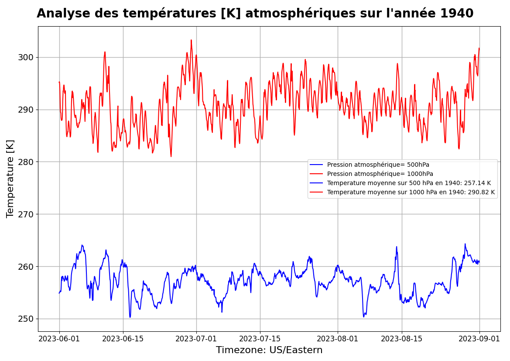

# Projet Hackathon pour les observations des prévisions de la température atmosphérique

Objectif principal:  Déterminer les observations sur les prévisions de température atmosphériques pour améliorer le sentinel 4 sur les mesures climatiques à travers le monde.  
Problématique: Connaître le niveau du réchauffement climatique sur l'évolotion de la température  

&nbsp;  &nbsp; &nbsp;    

 <b> Conséquences de réchauffement climatique  à l’année 1940 et  2023 pour la période d’été </b> 

<b> LISTES DES PARTICIPANTS  </b>     
   
| NOM  | PRENOM |
|  ------ | ------ |
|TRAN|Vincent|
|DIOUF|Sylvain|
|AARAB|Yasmine|
|CHANSUK|Chatri|
|HOUNMENOU|Moise|

